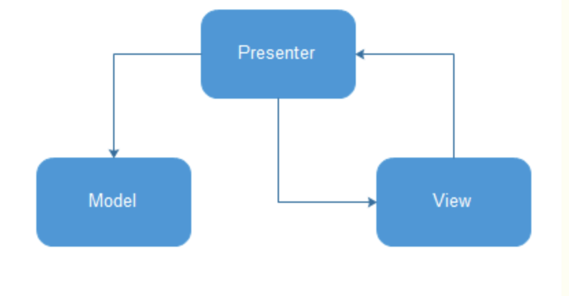

# helper —— Android工具包
> 整个包基于MVP模式进行开发



 此处发表两点我对于MVVM、MVP以及MVC的看法。首先自然不用多说的就是MVC的内存泄漏的问题，虽然作为比较后台开发最合适的框架，引用到安卓中框架中出现了致命的问题，提升空间自然就是MVVM和MVP了。然后就是这两个框架的思考了。MVVM和DataBinding的联合使用自然不用多说。虽然MVVM让编程更为轻松，但是DataBinding的使用使更多的本来可以不出现的那部分内存大量的出现，然后就是长时间编译问题了。

虽然我在一些掘金的文章上会看到这是的发言MVVM是对MVP的提升，但是从我的角度看来，各自有自己的特长吧，两者至少都解决了MVC框架的内存泄漏问题。
## 基于MVP模式的框架使用模版
```java
MVP也就是三个部分，在图示中已经比较清晰的展示了.
下面是整个继承和使用的过程。
1. Presenter的继承
public class xxxPresenter extends BasePresenter<xxxActivity, xxxModel, xxxContract.Presenter> {

    @Override
    public xxxContract.Presenter getContract() {
        return new xxxContract.Presenter<JavaBean>() {
            @Override
            public void request(需要传入的数据) {
                try {
                    m.getContract().execute(需要传入的数据);
                } catch (Exception e) {
                    e.printStackTrace();
                }
            }

            @Override
            public void responseResult(JavaBean javaBean) {
                getView().getContract().handlerResult(javaBean);
            }
        };
    }

    @Override
    public xxxModel getModel() {
        return new xxxMode(this);
    }
}

2. Model的继承
public class xxxModel extends BaseModel<xxxPresenter, xxxContract.Model> {

    public xxxModel(xxxPresenter xxxPresenter) {
        super(xxxPresenter);
    }

    @Override
    public xxxContract.Model getContract() {
        return new xxxContract.Model() {
            @Override
            public void execute(需要执行的参数) throws Exception {
                //---一系列逻辑处理

                p.getContract().responseResult(传回数据);
            }
        };
    }
}

3. Activity的继承
public class xxxActivity extends BaseActivity<xxxPresenter, xxxContract.View> {

    @Override
    public xxxContract.View getContract() {
        return new xxxContract.View<UserInfo>() {
            @Override
            public void handleResult(传回的数据) {
                //---得到数据，并给用户以响应
            }
        };
    }

    @Override
    public xxxPresenter getPresenter() {
        return new xxxPresenter();
    }
}

4. 契约的建立（BaseEntity已创建）
public interface xxxContract {

    interface Model {
        void execute(需要处理的数据) throws Exception;
    }

    interface View<T extends BaseEntity> {
        void handleResult(T t);
    }

    interface Presenter<T extends BaseEntity> {
        void request(String name, String pwd);
        void responseResult(T t);
    }
}
```


## RecyclerView篇
> 部分思路借鉴于SHEHUAN的BaseAdapter。
### 搭建思路
在使用Recyclerview时，我们最需要使用的东西是什么？**Adapter**
基于对Adapter的封装，加入自动加载的元素，我使用了showSize来表示

### 代码使用
```java

```